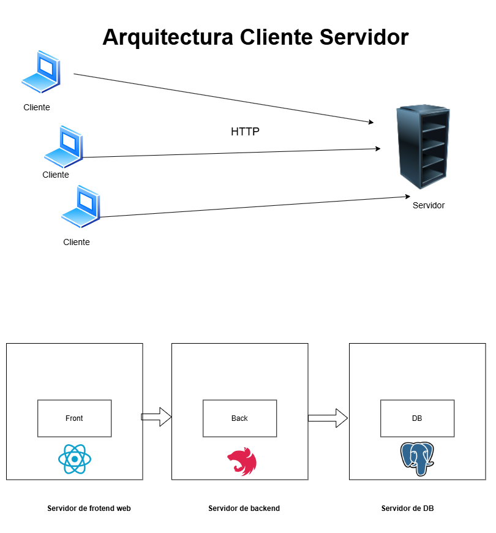
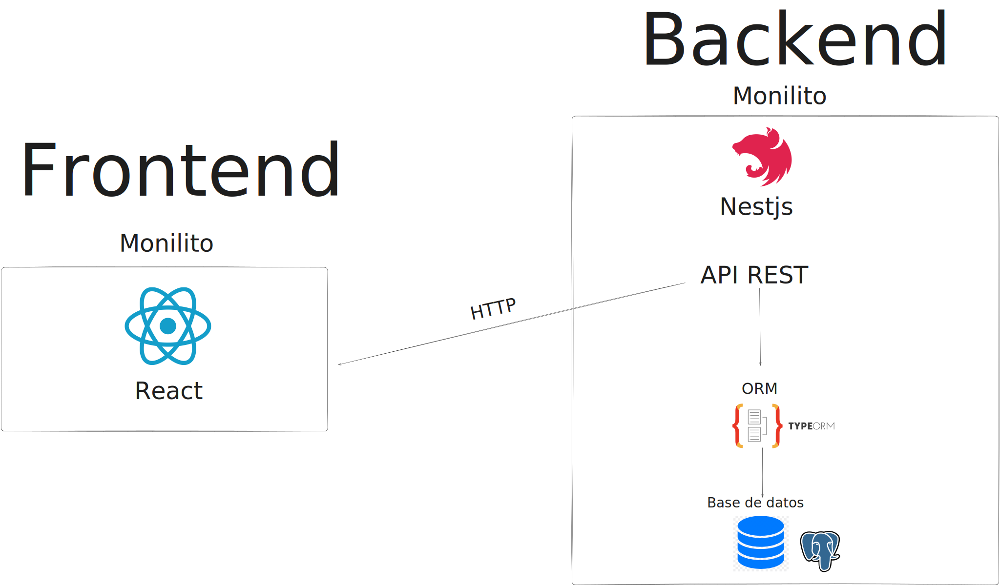

# Arquitectura Cliente-Servidor

La arquitectura cliente-servidor es un modelo de diseño de software en el que las tareas y cargas de trabajo se dividen entre los proveedores de recursos o servicios, llamados servidores, y los solicitantes de servicios, llamados clientes.

### Cliente
Parte de la aplicación que interactúa directamente con el usuario.

### Servidor
Parte de la aplicación que maneja las solicitudes del cliente, procesa los datos y devuelve las respuestas al cliente. 

# Tecnologías en el sistema

## Frontend

Para el frontend, estamos utilizando React. React nos permite construir una interfaz de usuario dinámica y eficiente, facilitando la creación de componentes reutilizables y la gestión del estado de la aplicación. Algunas de las ventajas de utilizar React incluyen:

- **Componentes Reutilizables**: React permite crear componentes que se pueden reutilizar en diferentes partes de la aplicación, lo que mejora la eficiencia y la mantenibilidad del código.
- **Virtual DOM**: React utiliza un Virtual DOM para optimizar las actualizaciones de la interfaz de usuario, lo que resulta en un rendimiento más rápido.
- **Gran ecosistema**: React tiene un ecosistema amplio con muchas bibliotecas y herramientas que facilitan el desarrollo de aplicaciones complejas.

## Backend

Para el backend, estamos utilizando NestJS. NestJS es un framework progresivo de Node.js que nos permite construir aplicaciones del lado del servidor de manera eficiente y escalable. El backend se implementará como un monolito, lo que significa que todas las funcionalidades estarán integradas en una única aplicación. Algunas características clave de NestJS incluyen:

- **Modularidad**: NestJS permite organizar el código en módulos, lo que facilita la gestión y escalabilidad de la aplicación.
- **Inyección de Dependencias**: NestJS utiliza un sistema de inyección de dependencias que mejora la mantenibilidad y testabilidad del código.
- **Controladores**: Los controladores en NestJS manejan las solicitudes entrantes y devuelven las respuestas al cliente. Actúan como una capa intermedia entre los servicios y las rutas de la aplicación.
- **Services**: Los servicios contienen la lógica de negocio de la aplicación. Son responsables de interactuar con la base de datos a través del ORM y realizar operaciones CRUD.
- **Entities**: Las entidades representan las tablas de la base de datos en el código. Cada entidad se mapea a una tabla específica y define las columnas y sus tipos de datos.
- **DTO's**: Los DTOs (Data Transfer Objects) se utilizan para definir la estructura de los datos que se envían y reciben a través de la API. Ayudan a validar y tipar los datos de entrada y salida.

## Base de Datos

La base de datos que estamos utilizando es PostgreSQL. PostgreSQL es un sistema de gestión de bases de datos relacional y orientado a objetos, conocido por su robustez, rendimiento y open source.

## ORM

Para interactuar con la base de datos desde el backend, utilizaremos un ***ORM (Object-Relational Mapping)*** . El ORM nos permitirá mapear nuestras entidades de base de datos a objetos en nuestro código, facilitando las operaciones CRUD (Crear, Leer, Actualizar, Eliminar) y mejorando la mantenibilidad del código. Algunas ventajas de utilizar un ORM incluyen:

- **Abstracción de Consultas SQL**: El ORM abstrae las complejidades de las consultas SQL, permitiendo a los desarrolladores trabajar con la base de datos de manera más intuitiva.
- **Mantenimiento Simplificado**: Al utilizar un ORM, el código de acceso a datos es más fácil de mantener y actualizar.
- **Seguridad**: El ORM ayuda a prevenir inyecciones SQL al utilizar consultas parametrizadas.

